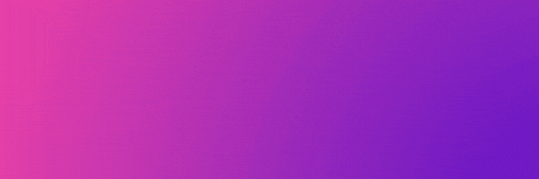
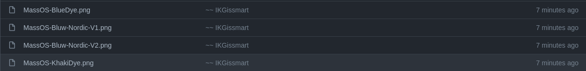
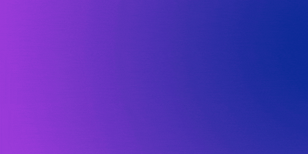

## 💠 MassOS-Wallpaper
Additional Wallpapers for MassOS Operating System.

## 🔹 Download
To Download All the Wallpaper use following command
```
git clone https://github.com/IKGissmart/MassOS-Additional-Wallpapers
``` 
## 🔹 Want to Suggest? 
Suggest or Upload Community-Made Wallpapers For MassOS [here](https://github.com/IKGissmart/MassOS-Additional-Wallpapers/issues/2).
Basic(Starter) Assets(logos) are Provided in [Assets Folder](https://github.com/IKGissmart/MassOS-Additional-Wallpapers/tree/main/Basic-Assets) to make your wallpaper creation more easy and less tedious.
## 🔹 Wallpaper Showcase 
#### For Wallpaper Showcase go to [**Gallery**](https://github.com/IKGissmart/MassOS-Additional-Wallpapers/blob/main/Gallery.md)
## 🔹 Rights/Credits 
The Credits of wallpapers can be shown in commits by two tildes and then Author Name (~~ NAME) For Example: 

 
- ᴀʟʟ ʀɪɢʜᴛꜱ ᴏꜰ [**ᴍᴀꜱꜱᴏꜱ ᴏᴘᴇʀᴀᴛɪɴɢ ꜱʏꜱᴛᴇᴍ**](https://github.com/TheSonicMaster/MassOS) ɪꜱ ʀᴇꜱᴇʀᴠᴇᴅ ʙʏ [**ᴛʜᴇ ꜱᴏɴɪᴄ ᴍᴀꜱᴛᴇʀ**](https://github.com/TheSonicMaster)
- ᴛʜɪꜱ ɢɪᴛʜᴜʙ ᴘᴀɢᴇ ɪꜱ ᴄʀᴇᴀᴛᴇᴅ ᴀɴᴅ (ᴄᴜʀʀᴇɴᴛʟʏ) ᴍᴀɪɴᴛᴀɪɴᴇᴅ ʙʏ (ᴍᴇ) [**ɪᴋɢɪꜱꜱᴍᴀʀᴛ**](https://github.com/IKGissmart)
